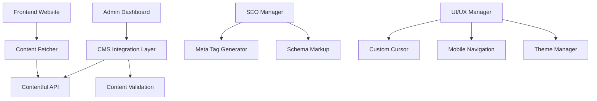

# Admin CMS Integration & Final Fixes Design Document

## Overview

This design document outlines the comprehensive solution for integrating Contentful CMS with the admin dashboard, fixing UI/UX issues including cursor visibility and mobile navigation, resolving color conflicts, and implementing advanced SEO optimization targeting "Muhamad Ali Ridho" as the primary keyword.

## Architecture

### System Components



### Data Flow

1. **Content Creation Flow**: Admin Dashboard → Validation → Contentful API → Live Website
2. **Content Display Flow**: Website Request → Content Fetcher → Contentful API → Rendered Page
3. **SEO Flow**: Page Load → SEO Manager → Meta Tags + Schema → Search Engines

## Components and Interfaces

### 1. Admin CMS Integration

#### CMS Manager Interface

```typescript
interface CMSManager {
  createBlogPost(data: BlogPostData): Promise<ContentfulEntry>;
  createProject(data: ProjectData): Promise<ContentfulEntry>;
  updateContent(id: string, data: ContentData): Promise<ContentfulEntry>;
  deleteContent(id: string): Promise<boolean>;
  publishContent(id: string): Promise<boolean>;
  previewContent(data: ContentData): Promise<string>;
}
```

#### Content Types

```typescript
interface BlogPostData {
  title: string;
  slug: string;
  excerpt: string;
  content: string;
  tags: string[];
  publishDate: Date;
  status: "draft" | "published";
}

interface ProjectData {
  title: string;
  slug: string;
  description: string;
  category: "web" | "mobile" | "iot" | "ai-ml" | "other";
  featured: boolean;
  technologies: string[];
  liveUrl?: string;
  sourceUrl?: string;
}
```

### 2. Custom Cursor System

#### Cursor Manager

```typescript
interface CursorManager {
  initialize(): void;
  updatePosition(x: number, y: number): void;
  setHoverState(state: "default" | "hover" | "click"): void;
  show(): void;
  hide(): void;
  isVisible(): boolean;
}
```

### 3. Mobile Navigation System

#### Navigation Manager

```typescript
interface NavigationManager {
  toggleMobileMenu(): void;
  closeMobileMenu(): void;
  openMobileMenu(): void;
  isMenuOpen(): boolean;
  initializeEventListeners(): void;
}
```

### 4. SEO Optimization System

#### SEO Manager

```typescript
interface SEOManager {
  generateMetaTags(page: PageData): MetaTags;
  generateSchemaMarkup(type: "person" | "article" | "website"): SchemaMarkup;
  optimizeForKeyword(content: string, keyword: string): string;
  generateSitemap(): string;
}
```

## Data Models

### Content Entry Model

```typescript
interface ContentEntry {
  id: string;
  contentType: "simpleBlog" | "simpleProject";
  fields: Record<string, any>;
  status: "draft" | "published";
  createdAt: Date;
  updatedAt: Date;
  publishedAt?: Date;
}
```

### SEO Data Model

```typescript
interface SEOData {
  title: string;
  description: string;
  keywords: string[];
  canonicalUrl: string;
  openGraph: {
    title: string;
    description: string;
    image: string;
    type: string;
  };
  schema: SchemaMarkup;
}
```

## Correctness Properties

_A property is a characteristic or behavior that should hold true across all valid executions of a system-essentially, a formal statement about what the system should do. Properties serve as the bridge between human-readable specifications and machine-verifiable correctness guarantees._

### Property 1: Content Creation Consistency

_For any_ valid content data submitted through the admin interface, the content should be successfully created in Contentful with the correct content type and all required fields populated
**Validates: Requirements 1.2, 1.3**

### Property 2: Real-time Content Synchronization

_For any_ content published through the admin dashboard, it should appear on the live website within the specified time limit and be accessible to all users
**Validates: Requirements 1.4, 7.1**

### Property 3: Content Update Propagation

_For any_ content modification made through the admin interface, all related pages and components should reflect the updated content consistently
**Validates: Requirements 1.5, 7.2**

### Property 4: Cursor Visibility Consistency

_For any_ page navigation or interaction, the custom cursor should remain visible and functional across all desktop viewport sizes
**Validates: Requirements 2.1, 2.3, 2.5**

### Property 5: Cursor Interaction Feedback

_For any_ interactive element hover event, the cursor should provide appropriate visual feedback without disappearing or malfunctioning
**Validates: Requirements 2.2, 2.4**

### Property 6: Mobile Navigation Consistency

_For any_ page in the website, clicking the mobile menu button should open the navigation menu with identical functionality and appearance
**Validates: Requirements 3.1, 3.3**

### Property 7: Mobile Menu Interaction

_For any_ mobile menu state, all navigation links should be functional and the menu should close when clicking outside the menu area
**Validates: Requirements 3.4, 3.5**

### Property 8: Theme Color Consistency

_For any_ theme switch operation, all UI elements should maintain proper color contrast and visual hierarchy without conflicts
**Validates: Requirements 4.1, 4.2, 4.5**

### Property 9: Interactive Element Styling

_For any_ interactive element (buttons, links, forms), hover and focus states should be visually distinct and accessible
**Validates: Requirements 4.3, 4.4**

### Property 10: SEO Keyword Optimization

_For any_ page on the website, the primary keyword "Muhamad Ali Ridho" should appear in strategic SEO locations with proper density and context
**Validates: Requirements 5.1, 5.3**

### Property 11: SEO Metadata Completeness

_For any_ page load, all required SEO metadata including Open Graph tags and schema markup should be present and valid
**Validates: Requirements 5.2, 5.4, 5.5**

### Property 12: Admin Interface Functionality

_For any_ content management operation in the admin dashboard, the interface should provide appropriate tools and feedback for successful completion
**Validates: Requirements 6.2, 6.4, 6.5**

### Property 13: Content Deletion Synchronization

_For any_ content deletion operation, the content should be immediately removed from all relevant pages and no longer accessible to users
**Validates: Requirements 7.3**

### Property 14: Graceful Degradation

_For any_ Contentful service unavailability, the website should display cached or fallback content without breaking functionality
**Validates: Requirements 7.5**

### Property 15: Performance and Accessibility Standards

_For any_ page load or user interaction, the website should maintain performance scores above 90 and full accessibility compliance
**Validates: Requirements 8.1, 8.2, 8.4, 8.5**

## Error Handling

### Content Management Errors

- **Contentful API Failures**: Implement retry logic with exponential backoff
- **Validation Errors**: Provide clear user feedback with specific field errors
- **Network Timeouts**: Show loading states and retry options
- **Authentication Issues**: Redirect to login or show authentication errors

### UI/UX Error Handling

- **Cursor Initialization Failures**: Fallback to default cursor
- **Mobile Menu Failures**: Ensure basic navigation remains functional
- **Theme Switch Errors**: Maintain current theme and log errors
- **Performance Issues**: Implement progressive loading and optimization

### SEO Error Handling

- **Missing Metadata**: Use default values with proper fallbacks
- **Schema Validation Errors**: Log errors but don't break page rendering
- **Image Optimization Failures**: Use original images as fallback

## Testing Strategy

### Unit Testing

- Test individual CMS operations (create, update, delete, publish)
- Test cursor state management and visibility functions
- Test mobile navigation toggle and state management
- Test SEO metadata generation and validation
- Test theme switching and color management

### Integration Testing

- Test end-to-end content creation workflow from admin to live site
- Test cursor behavior across different page types and interactions
- Test mobile navigation functionality across all pages
- Test SEO optimization across different content types
- Test performance under various network conditions

### Property-Based Testing

- Use fast-check or similar library for JavaScript/TypeScript
- Generate random content data to test content management properties
- Test cursor behavior with random mouse movements and interactions
- Test mobile navigation with various viewport sizes and orientations
- Test SEO optimization with different content structures and lengths

### Performance Testing

- Lighthouse audits for performance, accessibility, and SEO scores
- Load testing for content management operations
- Mobile performance testing across different devices
- SEO crawling simulation to verify search engine optimization

### Accessibility Testing

- Screen reader compatibility testing
- Keyboard navigation testing
- Color contrast validation
- Focus management testing
- ARIA attributes validation

## Implementation Phases

### Phase 1: Core CMS Integration (Priority: High)

1. Set up admin dashboard CMS interface
2. Implement Contentful API integration for content management
3. Create content creation and editing forms
4. Implement real-time content synchronization

### Phase 2: UI/UX Fixes (Priority: High)

1. Fix custom cursor visibility issues across all pages
2. Resolve mobile navigation problems
3. Fix color conflicts and improve contrast
4. Implement consistent theming

### Phase 3: SEO Optimization (Priority: Medium)

1. Implement comprehensive SEO metadata system
2. Add schema markup for personal/professional website
3. Optimize content for "Muhamad Ali Ridho" keyword
4. Generate XML sitemap and robots.txt

### Phase 4: Performance & Polish (Priority: Medium)

1. Optimize images and assets
2. Implement progressive loading
3. Add performance monitoring
4. Final accessibility improvements

## Security Considerations

### Content Management Security

- Implement proper authentication for admin dashboard
- Validate and sanitize all user inputs
- Use HTTPS for all API communications
- Implement rate limiting for API calls

### Data Protection

- Secure storage of Contentful API keys
- Implement proper error handling without exposing sensitive data
- Regular security audits of admin interface
- Content validation to prevent XSS attacks

## Deployment Strategy

### Development Environment

- Local development with hot reloading
- Contentful preview environment for testing
- Comprehensive testing suite execution

### Staging Environment

- Full production simulation
- SEO testing and validation
- Performance benchmarking
- User acceptance testing

### Production Deployment

- Zero-downtime deployment strategy
- CDN optimization for global performance
- Monitoring and alerting setup
- Rollback procedures for critical issues
