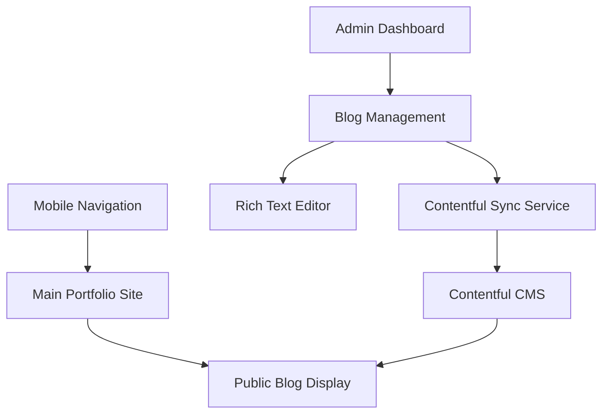
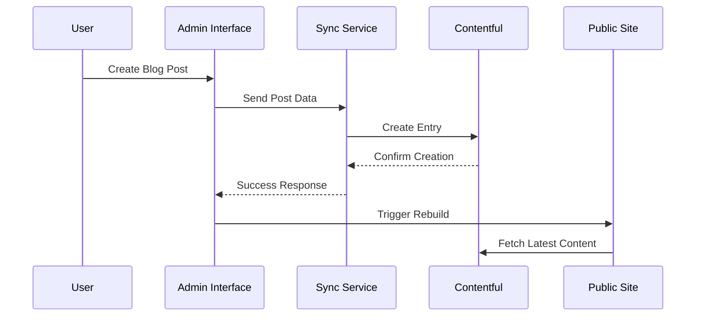
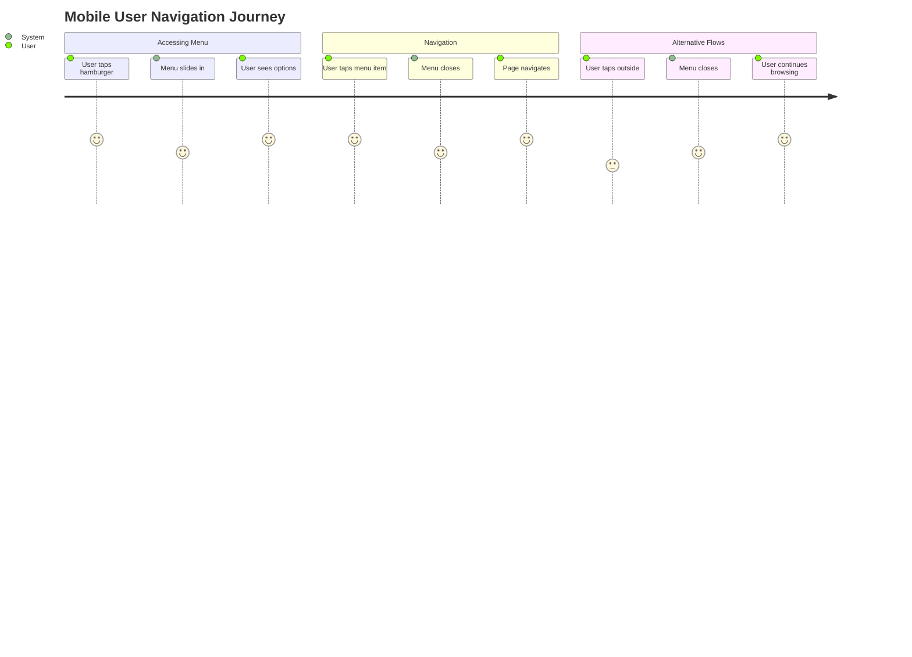
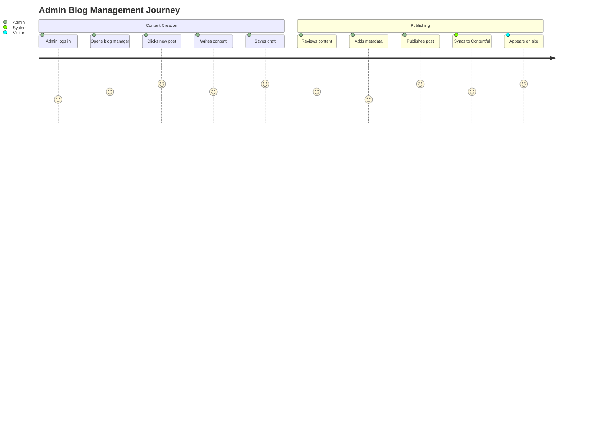

# Design Document

## Overview

This design addresses critical mobile navigation issues and establishes a comprehensive blog management system with seamless Contentful integration. The solution provides both user-facing improvements and administrative capabilities for content management.

## Architecture

### System Components



### Data Flow



## Components and Interfaces

### 1. Mobile Navigation Component

**File:** `src/components/MobileNavigation.astro`

```typescript
interface MobileNavigationProps {
  isOpen: boolean;
  onToggle: () => void;
  navigationItems: NavigationItem[];
}

interface NavigationItem {
  label: string;
  href: string;
  icon?: string;
}
```

**Features:**
- Smooth slide-in animation from right
- Backdrop blur effect
- Touch-friendly button sizes (minimum 44px)
- Proper focus management for accessibility
- Escape key and outside click to close

### 2. Blog Management Interface

**File:** `src/components/admin/BlogManager.astro`

```typescript
interface BlogPost {
  id: string;
  title: string;
  slug: string;
  content: RichTextContent;
  excerpt: string;
  thumbnail?: string;
  category: string;
  tags: string[];
  publishedAt?: Date;
  status: 'draft' | 'published' | 'archived';
  contentfulId?: string;
  lastSyncAt?: Date;
}
```

### 3. Rich Text Editor

**File:** `src/components/admin/RichTextEditor.astro`

**Features:**
- WYSIWYG editing with toolbar
- Image upload and management
- Link insertion with validation
- Code block support
- Markdown export/import
- Auto-save functionality

### 4. Contentful Sync Service

**File:** `src/utils/contentfulSync.ts`

```typescript
interface SyncService {
  syncToContentful(post: BlogPost): Promise<string>;
  syncFromContentful(contentfulId: string): Promise<BlogPost>;
  batchSync(): Promise<SyncResult[]>;
  handleConflicts(conflicts: SyncConflict[]): Promise<void>;
}
```

## Data Models

### Blog Post Schema

```typescript
const blogPostSchema = z.object({
  title: z.string().min(1).max(200),
  slug: z.string().regex(/^[a-z0-9-]+$/),
  content: z.object({
    nodeType: z.literal('document'),
    content: z.array(z.any())
  }),
  excerpt: z.string().max(300),
  thumbnail: z.string().url().optional(),
  category: z.enum(['tech', 'ai', 'web-dev', 'iot', 'personal']),
  tags: z.array(z.string()).max(10),
  publishedAt: z.date().optional(),
  status: z.enum(['draft', 'published', 'archived']),
  seo: z.object({
    metaTitle: z.string().max(60).optional(),
    metaDescription: z.string().max(160).optional(),
    ogImage: z.string().url().optional()
  }).optional()
});
```

## User Journey & Wireframes

### Mobile Navigation Journey



### Blog Management Journey



### Wireframes

#### Mobile Navigation (Before Fix)
```
┌─────────────────┐
│ [☰]        LOGO │ ← Hamburger button
│                 │
│   HERO CONTENT  │ ← Menu doesn't appear when tapped
│                 │
│                 │
└─────────────────┘
```

#### Mobile Navigation (After Fix)
```
┌─────────────────┐ ┌─────────────────┐
│ [✕]        LOGO │ │ [☰]        LOGO │
│ ┌─────────────┐ │ │                 │
│ │ • Home      │ │ │   HERO CONTENT  │
│ │ • About     │ │ │                 │
│ │ • Projects  │ │ │                 │
│ │ • Blog      │ │ │                 │
│ │ • Contact   │ │ │                 │
│ └─────────────┘ │ │                 │
└─────────────────┘ └─────────────────┘
   Menu Open           Menu Closed
```

#### Blog Management Dashboard
```
┌─────────────────────────────────────┐
│ Admin Dashboard                     │
├─────────────────────────────────────┤
│ Blog Posts                [+ New]   │
├─────────────────────────────────────┤
│ ┌─ Post Title 1 ──────────────────┐ │
│ │ Draft • 2 days ago              │ │
│ │ [Edit] [Publish] [Delete]       │ │
│ └─────────────────────────────────┘ │
│ ┌─ Post Title 2 ──────────────────┐ │
│ │ Published • 1 week ago          │ │
│ │ [Edit] [Unpublish] [Delete]     │ │
│ └─────────────────────────────────┘ │
└─────────────────────────────────────┘
```

#### Rich Text Editor
```
┌─────────────────────────────────────┐
│ [B] [I] [U] [H1] [H2] [•] [1.] [🔗] │
├─────────────────────────────────────┤
│ # Blog Post Title                   │
│                                     │
│ This is the content of the blog     │
│ post with **bold text** and        │
│ *italic text*.                      │
│                                     │
│ ## Subheading                       │
│                                     │
│ - List item 1                       │
│ - List item 2                       │
│                                     │
├─────────────────────────────────────┤
│ [Save Draft] [Preview] [Publish]    │
└─────────────────────────────────────┘
```

## Current Bugs Analysis

### 1. Mobile Navigation Issues
- **Problem**: Hamburger menu not showing navigation items
- **Root Cause**: JavaScript event handlers not properly attached
- **Impact**: Mobile users cannot navigate the site
- **Priority**: Critical

### 2. Missing Blog Infrastructure
- **Problem**: No blog management system exists
- **Root Cause**: Only project content collection is implemented
- **Impact**: Cannot create or manage blog content
- **Priority**: High

### 3. Contentful Integration Gaps
- **Problem**: No two-way sync between admin and Contentful
- **Root Cause**: Only read operations implemented
- **Impact**: Content management workflow is incomplete
- **Priority**: High

### 4. Admin Interface Limitations
- **Problem**: Basic admin interface without blog management
- **Root Cause**: Admin was built only for project management
- **Impact**: Limited content management capabilities
- **Priority**: Medium

## Error Handling

### Mobile Navigation
- Handle touch events properly on all devices
- Graceful degradation for JavaScript-disabled browsers
- Proper focus management for screen readers

### Blog Management
- Validation errors with clear user feedback
- Auto-save to prevent content loss
- Conflict resolution for simultaneous edits
- Offline capability with sync when online

### Contentful Integration
- Retry mechanisms for failed API calls
- Graceful handling of rate limits
- Backup content storage during sync failures
- Clear error messages for sync conflicts

## Correctness Properties

*A property is a characteristic or behavior that should hold true across all valid executions of a system-essentially, a formal statement about what the system should do. Properties serve as the bridge between human-readable specifications and machine-verifiable correctness guarantees.*

### Mobile Navigation Properties

**Property 1: Menu visibility toggle**
*For any* mobile device, tapping the hamburger button should toggle the navigation menu visibility with proper animation classes applied
**Validates: Requirements 1.1**

**Property 2: Menu item navigation**
*For any* open navigation menu, all menu items should be clickable and trigger proper navigation events
**Validates: Requirements 1.2**

**Property 3: Menu close behavior**
*For any* open navigation menu, tapping outside the menu area or the close button should close the menu with animation
**Validates: Requirements 1.3**

**Property 4: Background scroll prevention**
*For any* open navigation menu, the background content should have scroll disabled (overflow: hidden on body)
**Validates: Requirements 1.4**

### Blog Management Properties

**Property 5: Blog list display**
*For any* authenticated admin user, accessing the blog management page should display all existing blog posts with proper metadata
**Validates: Requirements 2.1**

**Property 6: Editor initialization**
*For any* "Create New Post" action, the system should initialize a rich text editor with all required formatting tools
**Validates: Requirements 2.2**

**Property 7: Blog post validation and storage**
*For any* blog post data, saving should validate all required fields and store the content with proper timestamps
**Validates: Requirements 2.3**

**Property 8: Publish workflow**
*For any* valid blog post, publishing should make it visible on the public blog page and update its status
**Validates: Requirements 2.4**

**Property 9: Edit preservation**
*For any* existing blog post, editing should preserve the original creation date while updating modification timestamps
**Validates: Requirements 2.5**

### Contentful Sync Properties

**Property 10: Admin to Contentful sync**
*For any* blog post created in the admin interface, the system should create corresponding content in Contentful with matching data
**Validates: Requirements 3.1**

**Property 11: Contentful to admin sync**
*For any* blog post updated in Contentful, the admin interface should reflect the changes within the sync interval
**Validates: Requirements 3.2**

**Property 12: Deletion synchronization**
*For any* blog post deleted from either platform, the deletion should be synchronized to the other platform
**Validates: Requirements 3.3**

**Property 13: Sync error handling**
*For any* failed synchronization attempt, the system should log errors and provide retry mechanisms
**Validates: Requirements 3.4**

**Property 14: Data consistency**
*For any* blog post, the system should always display the most recent version regardless of the source platform
**Validates: Requirements 3.5**

### Rich Text Editor Properties

**Property 15: Formatting tools availability**
*For any* rich text editor instance, all formatting options (bold, italic, headers, lists) should be available and functional
**Validates: Requirements 4.1**

**Property 16: Image upload handling**
*For any* valid image file, the editor should support upload and proper positioning within the content
**Validates: Requirements 4.2**

**Property 17: URL validation**
*For any* URL input, the system should validate the format and provide appropriate feedback
**Validates: Requirements 4.3**

**Property 18: Format preservation round-trip**
*For any* rich text content, saving and loading should preserve all formatting and convert properly to Contentful format
**Validates: Requirements 4.4**

**Property 19: Preview accuracy**
*For any* blog post content, the preview should match exactly how it appears on the public blog
**Validates: Requirements 4.5**

### Public Blog Properties

**Property 20: Blog list rendering**
*For any* collection of published blog posts, the public blog page should display them with thumbnails and excerpts
**Validates: Requirements 5.1**

**Property 21: Individual post display**
*For any* blog post, clicking should display the full content with proper formatting preserved
**Validates: Requirements 5.2**

**Property 22: Metadata display**
*For any* blog post, the system should display publication date, reading time estimate, and category tags
**Validates: Requirements 5.3**

**Property 23: Mobile optimization**
*For any* mobile device, blog posts should be optimized for touch interaction and readability
**Validates: Requirements 5.4**

**Property 24: Social sharing meta tags**
*For any* blog post, the system should generate proper meta tags for social media sharing
**Validates: Requirements 5.5**

### Admin Dashboard Properties

**Property 25: Dashboard statistics**
*For any* admin user, the dashboard should display current statistics for projects, blog posts, and analytics
**Validates: Requirements 6.1**

**Property 26: Quick actions availability**
*For any* content item, the system should provide quick actions for publish, edit, and delete operations
**Validates: Requirements 6.2**

**Property 27: List operations**
*For any* content collection, the system should support filtering, sorting, and search functionality
**Validates: Requirements 6.3**

**Property 28: Bulk operations**
*For any* selection of content items, the system should allow batch actions to be performed
**Validates: Requirements 6.4**

**Property 29: Sync status display**
*For any* Contentful synchronization operation, the system should display current status and any conflicts
**Validates: Requirements 6.5**

## Testing Strategy

### Unit Tests
- Mobile navigation component interactions
- Blog post validation and formatting
- Contentful API integration functions
- Rich text editor functionality

### Integration Tests
- End-to-end blog creation workflow
- Mobile navigation across different devices
- Contentful synchronization scenarios
- Admin authentication and authorization

### Property-Based Tests
- Blog post content validation across various inputs
- Mobile touch interaction reliability
- Contentful sync consistency verification